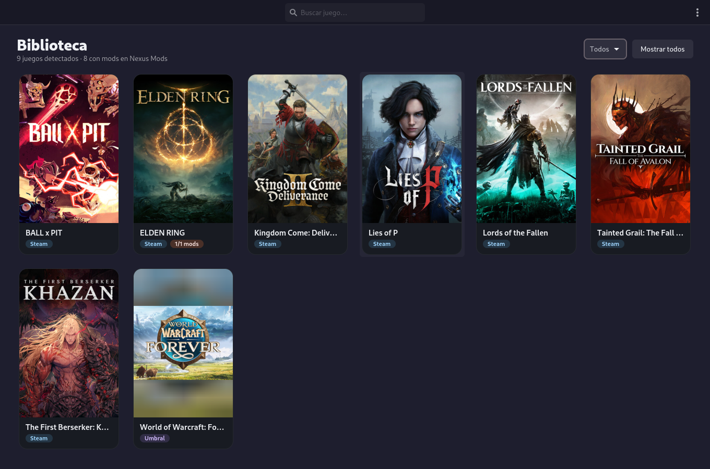
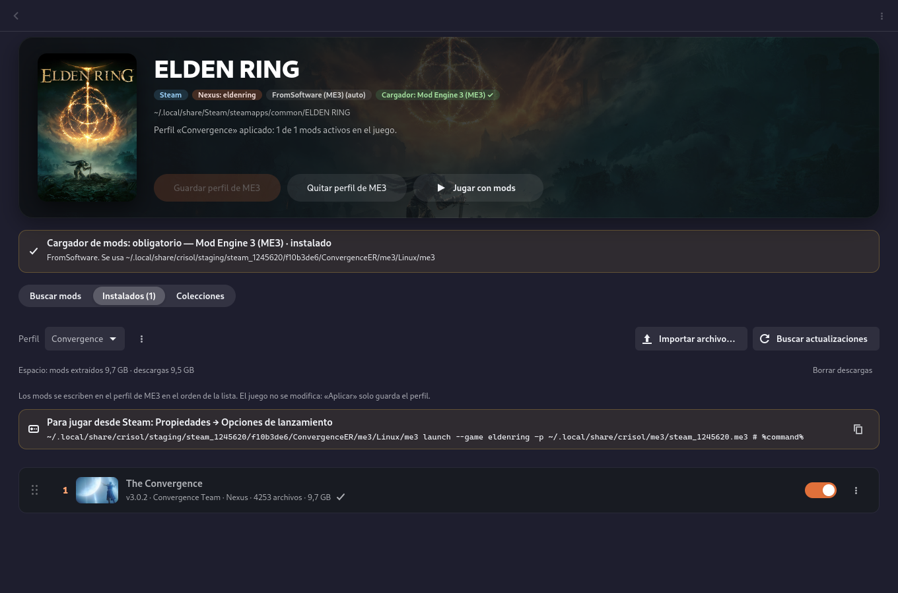
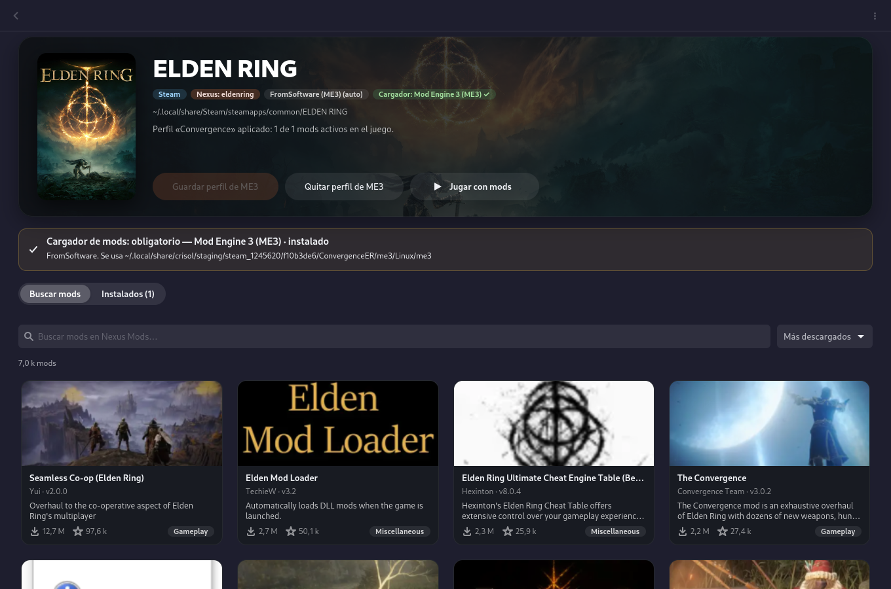
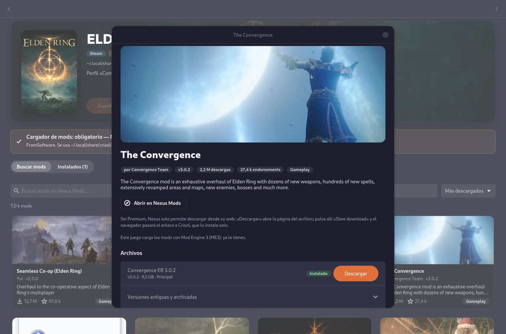
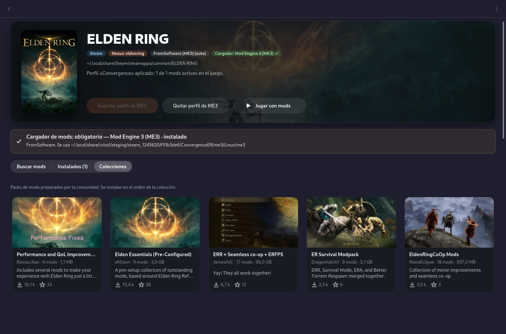
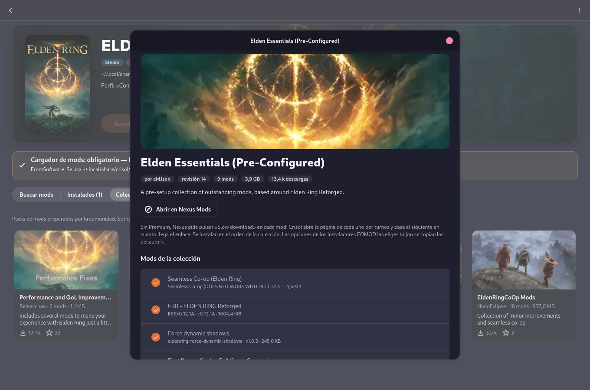
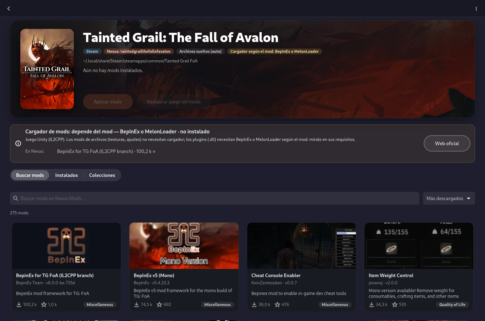
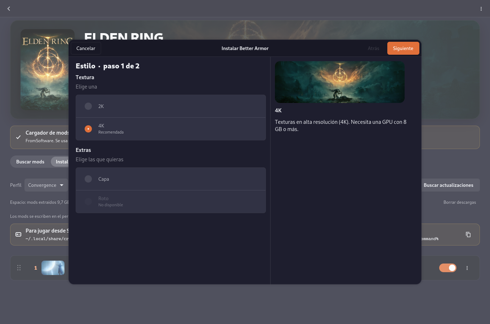

<p align="center"></p>

# 錬 Crisol

[](https://github.com/madkyp/crisol-app/actions/workflows/tests.yml)


[](https://github.com/madkyp/umbral-project)

**A mod manager for Steam and [Umbral](https://github.com/madkyp/umbral-project) games on Arch / CachyOS**, built with GTK4 / libadwaita, with **Nexus Mods** as the mod source.

Crisol finds the games you have installed, searches Nexus Mods for each one, downloads and verifies the mods and manages their **load order** like Vortex or Mod Organizer: drag and drop, profiles, file conflicts and a one-click **restore the game without mods**. It knows how each engine loads mods: copying files into the game, writing a `mod_order.txt`, prefixing Unreal `.pak` files, or launching FromSoftware games through **Mod Engine 3** without touching the game at all. It also tells you **whether a game needs a mod loader** (ME3, BepInEx, MelonLoader, UE4SS) and where to get it.

> The interface is in **English and Spanish** (*Preferences → Language*; by default, your system's).

> *Crisol* is Spanish for *crucible*: the vessel where metals are melted and mixed — like mods into a game.

> ⚠️ **Alpha version.** Crisol works end to end on the author's machine (CachyOS + Hyprland), tested with Elden Ring, Kingdom Come: Deliverance II, Lies of P and Tainted Grail, but it is young software: expect rough edges and please report what breaks.

> 🤖 **This project was built with the help of AI.** See the [disclaimer](#-disclaimer) below.

---

## 📸 Screenshots

Using **ELDEN RING** + **The Convergence** as the example (interface in Spanish; it's also available in English).

| Library | Game page: mods and Mod Engine 3 |
|---|---|
|  |  |
| **Search Nexus Mods** | **Mod details and files** |
|  |  |
| **Nexus collections** | **A collection's mods, installed in order** |
|  |  |
| **Mod loader check** (Tainted Grail: BepInEx suggested from Nexus) | **FOMOD installer wizard** |
|  |  |

---

## ✨ Features

### 📚 Library
- Detects installed **Steam** games (every library in `libraryfolders.vdf`) and **Umbral** games (`~/.config/umbral/config.json`), with the covers Steam and Umbral already have on disk (when Steam has no portrait cover cached, the official one is fetched once from Steam's CDN; landscape images are shown whole over a blurred backdrop instead of being cropped).
- Links each game to its Nexus Mods page automatically (and lets you fix it when the name differs, e.g. *Lords of the Fallen (2023)*). Games without mods on Nexus are hidden unless you ask to see them.

### 🔎 Search and download
- Nexus Mods search per game: relevance, most downloaded, top endorsed, recently updated, newest — with images, author, version, downloads and the mod's requirements and files.
- **Premium accounts** download directly. **Free accounts** start the download on the website (*Slow download*) and the browser hands the `nxm://` link to Crisol, which downloads it, **checks size and md5 against Nexus**, extracts it (zip, 7z, rar…) and installs it. Archives downloaded by hand can be imported too.
- Downloads that get cut off **resume** where they stopped next time you press *Slow download*.
- **FOMOD installers** (the options wizard many Nexus mods ship): steps, groups, required / recommended / unavailable options, conditional steps and files. Your choices are kept for reinstalls and updates, and *Change installer options…* runs it again.
- **Collections**: each game's Nexus collections with their mods; install the ones you tick, in the collection's order (Premium: one after another by itself; free: Crisol opens each mod's download page in turn and moves on as soon as its link arrives).

### 🔄 Updates
- Crisol checks for new versions of your installed mods when it starts (at most every 12 h per game). The library marks games with updates.
- **Update to vX** finds the new file of that same mod on Nexus and installs it **in place**, keeping its position and state in every profile; **Update all** does the whole game.

### 🧩 Load order
- Drag and drop, enable / disable without uninstalling, **profiles** per game.
- **Conflicts**: which files two mods both ship and which one wins with the current order (also duplicates inside KCD2 `.pak` files).
- Missing **requirements** are flagged.
- **Disk space** per mod and per game; delete the downloaded archives (one or all) or choose not to keep them at all.

### 🛡️ Reversible
- Mods are applied with **reflinks** (instant copies on btrfs / xfs that use no extra space; hard links or plain copies elsewhere).
- Game files a mod replaces are moved to a backup first. **Restore game without mods** removes exactly what Crisol placed and brings the originals back — verified to leave the game folder byte-for-byte as it was (size, mtime and inode of every file).
- Files changed by someone else meanwhile (e.g. Steam's *Verify integrity*) are left alone.
- **Never while the game is running**: applying, restoring or reinstalling is blocked while the game is open (Steam's launch process, Proton `.exe` processes in the game folder, Umbral's `running.json`).
- **Save backups**: before applying mods or playing with them, Crisol copies the game's saves (found in the Proton prefix and the game folder: `steam_autocloud.vdf`, `.sav`, `.sl2`, `Saved`/`SaveGames` folders…). The last 5 are kept and can be restored from *Game settings → Saves*.

### 🔧 Mod loader check
Every game page says whether the game needs a mod loader — **required**, **depends on the mod** or **not needed** — whether it is installed, and links the loaders published for that game on Nexus. Before downloading, a mod's page warns when its requirements ask for a loader you don't have.

| Game type | Games | How mods are applied and ordered | Loader |
|---|---|---|---|
| **FromSoftware (ME3)** | Elden Ring, Nightreign, Dark Souls III, Sekiro, Armored Core VI | Nothing is copied into the game: Crisol writes a [Mod Engine 3](https://github.com/garyttierney/me3) profile with the enabled mods in order (packages, native DLLs, the mod's own savefile) and launches the game with `me3 launch` — or gives you the line for Steam's launch options | **ME3**, required. Taken from `PATH` or from a mod that bundles it (The Convergence does) |
| **Kingdom Come: Deliverance II** | KCD2 | One folder per mod in `mods/`; order written to `mods/mod_order.txt` (also a whitelist — mods you installed by hand are kept) | Not needed |
| **Unreal Engine** | Lies of P, Khazan, Lords of the Fallen… | `.pak/.ucas/.utoc` go to `<Project>/Content/Paks/~mods` renamed `001_`, `002_`… by order; other files relative to the game root | **UE4SS** only for script / LogicMods mods |
| **Loose files** | Unity games and the rest | Files on top of the game folder; the lower mod in the list wins a conflict | **BepInEx / MelonLoader** for plugin mods (Unity) |

The type is detected automatically and can be changed in *⋯ → Game settings* (installed mods are remapped without downloading them again). For ME3 games the same dialog has launch options (skip intro logos, boot cache) and, when a mod ships several ME3 profiles whose files are present (e.g. The Convergence normal / Seamless Co-op), which one to use.

---

## 📦 Install

Download the `.pkg.tar.zst` from the [latest release](https://github.com/madkyp/crisol-app/releases/latest) and install it:

```sh
sudo pacman -U crisol-*.pkg.tar.zst
```

After that, Crisol tells you when a new version is out and installs it for you (*Install* in the notice; it asks for your password). To build it yourself instead:

```sh
git clone https://github.com/madkyp/crisol-app && cd crisol-app
makepkg -si
```

Dependencies: `python python-gobject python-requests gtk4 libadwaita libsecret libarchive xdg-utils` (pacman pulls them in).

## 🚀 Getting started

1. *Menu → Preferences → Nexus Mods*: paste your **personal API key** (nexusmods.com → Preferences → API). It is stored in the system keyring (Secret Service); if there is none, in `~/.config/crisol/nexus.key` readable only by you — the dialog says which.
2. Same dialog: *nxm:// links → Use Crisol*, so the browser sends download links to Crisol. In Firefox, tick *always allow* the first time (or *Settings → Applications → nxm → Crisol*).
3. Open a game, search a mod, press **Download**, then **Slow download** on the website. When it finishes, press **Apply mods** (or **Save ME3 profile** → **Play with mods** for FromSoftware games).

> **Elden Ring on Linux:** ME3 uses the Proton that Steam has assigned to the game. If the game has none forced, set one in Steam → *Properties → Compatibility* (e.g. Proton Experimental); Crisol shows this hint if ME3 fails to start.

## ⌨️ Command line

| Command | |
|---|---|
| `crisol --list` | Detected games and their mods, as JSON (see [Integration](#-integration)) |
| `crisol --play <key>` | Play with mods: ME3 for FromSoftware games, Umbral for its games, Steam for the rest |
| `crisol --game <key>` | Open a game's page directly |
| `crisol --restore <key>` | Remove a game's mods without opening the window |
| `crisol --debug` | Detailed log in the terminal (always written to `~/.local/state/crisol/logs/crisol.log`) |

## 📁 Files

| Path | |
|---|---|
| `~/.config/crisol/config.json` | Settings, manual game ↔ Nexus links |
| `~/.local/share/crisol/games/` | Installed mods, profiles and load order per game |
| `~/.local/share/crisol/staging/` | Extracted mods |
| `~/.local/share/crisol/downloads/` | Downloaded archives |
| `~/.local/share/crisol/deploy/`, `backups/` | What is applied to each game and the originals it replaced |
| `~/.local/share/crisol/me3/` | Generated Mod Engine 3 profiles |
| `~/.local/share/crisol/saves/` | Save backups (last 5 per game) |

## 🌐 Mod sources

| Source | Status | Why |
|---|---|---|
| Nexus Mods | ✅ Integrated | Official API: GraphQL v2 (search, no key) + REST v1 (downloads with the user's key; non-Premium via `nxm://` links) |
| Thunderstore | ⏸ Not yet | Public API, but none of the author's games has a Thunderstore community |
| Steam Workshop | ⏸ Not yet | None of the author's games uses the Workshop |
| CurseForge | ⏸ Not yet | Requires an approved API key; mostly relevant for WoW addons |
| ModDB | ❌ No | No public API (only scraping) |

Crisol follows the [Nexus Mods API acceptable use policy](https://help.nexusmods.com/article/114-api-acceptable-use-policy): it identifies itself with `Application-Name` / `Application-Version`, each user uses **their own** key, nothing is stored on any server and no data is mirrored. Nexus asks public applications to be registered for SSO — that is pending, so for now Crisol uses each user's personal API key.

## 🔌 Integration

Crisol works with the author's other apps, and both use the same game keys (`steam:<appid>`, `umbral:<id>`):

- **[Umbral](https://github.com/madkyp/umbral-project)** (≥ 0.14.2): each game's ⋯ menu has **Mods (Crisol)**. Mods Crisol applies are in the game folder, so Umbral's **Play** already uses them. Crisol also reads Umbral's `running.json` so it never changes the files of a running game.
- **[Gaming Deck](https://github.com/madkyp/gaming-deck)** (formerly the GAMING tab of Control Deck): each game's page shows a **MODS** card (mods on, profile, pending changes, updates, missing loader) with **PLAY WITH MODS** and **OPEN IN CRISOL**.

Other apps can use the same: `crisol --list` prints, for each game, `key, name, source, id, dir, nexus, layout, mods, enabled, profile, applied, pending_changes, updates, loader {name, level, installed}` (it doesn't wait for the network); `crisol --game <key>` opens a game; `crisol --play <key>` plays it with mods.

## 🧪 Tests

```sh
python -m unittest discover -s tests -v
```

They build fake games of every type (KCD2, Unreal, loose files, ME3), install mods (FOMOD included), reorder, check conflicts and verify that restoring leaves the folder exactly as it was; they also cover resumed downloads (local HTTP server with and without `Range`), running-game detection, save backups, and that every text has its English translation.

## 🤖 Disclaimer

This project was created **with the help of AI** (Anthropic's Claude, through Claude Code). The code was written together with the AI, then reviewed, tested (see [Tests](#-tests)) and used on a real CachyOS + Hyprland system, but:

- It is an **alpha** and is provided **as is**, without warranty of any kind (see the [license](LICENSE)).
- It writes files into your game folders when you apply mods. Restoring is designed to be exact, but keep backups of anything important (save games especially).
- Mods that disable anti-cheat (like Mod Engine 3 does) mean **no official online play**; use them at your own risk.

Crisol is an independent project, **not affiliated with or endorsed by Nexus Mods, Valve, FromSoftware or any game publisher**. Game names and artwork belong to their owners; Crisol ships no game artwork — covers are read from your own Steam / Umbral installation and mod images come from Nexus Mods at runtime (the screenshots show the author's installation).

Found a bug or something that looks wrong? Please open an issue.

---

## License

MIT
